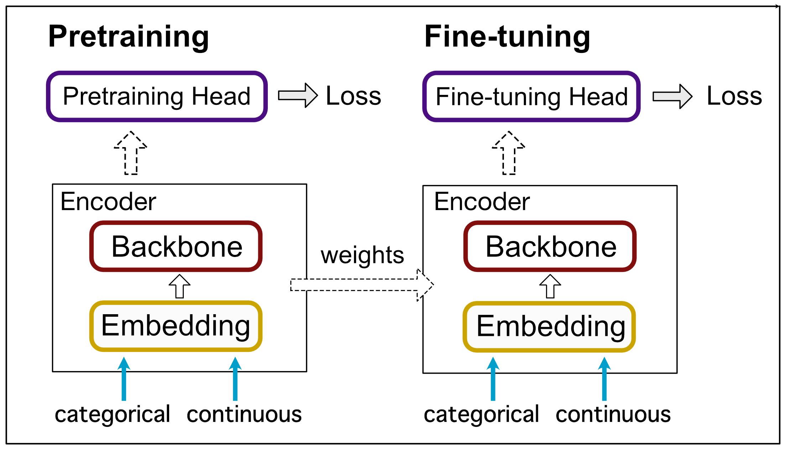

# deep-table
deep-table implements various state-of-the-art deep learning and self-supervised learning algorithms for tabular data using PyTorch.
## Design
### Architecture
As shown below, each pretraining/fine-tuning model is decomposed into two modules: **Encoder** and **Head**.



#### Encoder
Encoder has **Embedding** and **Backbone**.
- Embedding makes continuous/categorical features tokenized or simply normalized.
- Backbone processes the tokenized features.

#### Pretraining/Fine-tuning Head
Pretraining/Fine-tuning Head uses Encoder module for training.

## Implemented Methods
- [Revisiting Deep Learning Models for Tabular Data](https://arxiv.org/abs/2106.11959)
- [TabTransformer: Tabular Data Modeling Using Contextual Embeddings](https://arxiv.org/abs/2012.06678)
- [SAINT: Improved Neural Networks for Tabular Data via Row Attention and Contrastive Pre-Training](https://arxiv.org/abs/2106.01342)
- [VIME: Variational Information Maximizing Exploration](https://arxiv.org/abs/1605.09674)
- [Denoising Auto Encoder (kaggle)](https://www.kaggle.com/springmanndaniel/1st-place-turn-your-data-into-daeta)

### Available Modules
#### Encoder - Embedding
- FeatureEmbedding
- TabTransformerEmbedding
#### Encoder - Backbone
- MLPBackbone
- FTTransformerBackbone
- SAINTBackbone
#### Model - Head
- MLPHeadModel
#### Model - Pretraining
- DenoisingPretrainModel
- SAINTPretrainModel
- TabTransformerPretrainModel
- VIMEPretrainModel


## How To Use
### Step 0. Install
```bash
python setup.py install

# Installation with pip
pip install -e .
```

### Step 1. Define config.json
You have to define three configs at least.
1. encoder
2. model
3. trainer

Minimum configurations are as follows:
```python
from omegaconf import OmegaConf

encoder_config = OmegaConf.create({
    "embedding": {
        "name": "FeatureEmbedding",
    },
    "backbone": {
        "name": "FTTransformerBackbone",
    }
})

model_config = OmegaConf.create({
    "name": "MLPHeadModel"
})

trainer_config = OmegaConf.create({
    "max_epochs": 1,
})
```
Other parameters can be changed also by config.json if you want.


### Step 2. Define Datamodule
```python
from deep_table.data.data_module import TabularDatamodule


datamodule = TabularDatamodule(
    train=train_df,
    val=val_df,
    test=test_df,
    task="binary",
    dim_out=1,
    categorical_columns=["education", "occupation", ...],
    continuous_columns=["age", "hours-per-week", ...],
    target=["income"],
    num_categories=110,
)
```

### Step 3. Run Training
```python
from deep_table.estimators.base import Estimator
from deep_table.utils import get_scores


estimator = Estimator(
    encoder_config,      # Encoder architecture
    model_config,        # model settings (learning rate, scheduler...)
    trainer_config,      # training settings (epoch, gpu...)
)

estimator.fit(datamodule)
predict = estimator.predict(datamodule.dataloader(split="test"))
get_scores(predict, target, task="binary")
>>> {'accuracy': array([0.8553...]),
     'AUC': array([0.9111...]),
     'F1 score': array([0.9077...]),
     'cross_entropy': array([0.3093...])}
```

If you want to train a model with pretraining, write as follows:

```python
from deep_table.estimators.base import Estimator
from deep_table.utils import get_scores


pretrain_model_config = OmegaConf.create({
    "name": "SAINTPretrainModel"
})

pretrain_model = Estimator(encoder_config, pretrain_model_config, trainer_config)
pretrain_model.fit(datamodule)

estimator = Estimator(encoder_config, model_config, trainer_config)
estimator.fit(datamodule, from_pretrained=pretrain_model)
```

See [notebooks/train_adult.ipynb](./notebooks/train_adult.ipynb) for more details.


## Custom Datasets
You can use your own datasets.

0. Prepare datasets and create `DataFrame`
1. Preprocess `DataFrame`
2. Create your own datamodules using `TabularDatamodule`

Example code is shown below.

```python
import pandas as pd

import os,sys; sys.path.append(os.path.abspath(".."))
from deep_table.data.data_module import TabularDatamodule
from deep_table.preprocess import CategoryPreprocessor


# 0. Prepare datasets and create DataFrame
iris = pd.read_csv('https://raw.githubusercontent.com/mwaskom/seaborn-data/master/iris.csv')

# 1. Preprocessing pd.DataFrame
category_preprocesser = CategoryPreprocessor(categorical_columns=["species"], use_unk=False)
iris = category_preprocesser.fit_transform(iris)

# 2. TabularDatamodule
datamodule = TabularDatamodule(
    train=iris.iloc[:20],
    val=iris.iloc[20:40],
    test=iris.iloc[40:],
    task="multiclass",
    dim_out=3,
    categorical_columns=[],
    continuous_columns=["sepal_length", "sepal_width", "petal_length", "petal_width"],
    target=["species"],
    num_categories=0,
)
```
See [notebooks/custom_dataset.ipynb](./notebooks/custom_dataset.ipynb) for the full training example.

## Custom Models
You can also use your Embedding/Backbone/Model.
Set arguments as shown below.
```python
estimator = Estimator(
    encoder_config, model_config, trainer_config,
    custom_embedding=YourEmbedding, custom_backbone=YourBackbone, custom_model=YourModel
)
```
If custom models are set, the attributes `name` in corresponding configs will be overwritten.

See [notebooks/custom_model.ipynb](./notebooks/custom_model.ipynb) for more details.

